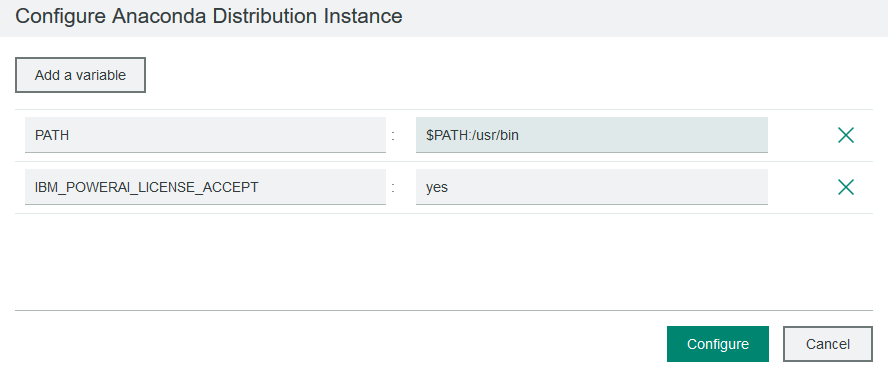

# WMLA-notebook

## Create an Anaconda environment.

   * Navigate to Workload -> Spark -> Anaconda Management. If Anaconda3-2019-03-Linux-ppc64le is not listed, download it from this location: https://repo.continuum.io/archive/Anaconda3-2019.03-Linux-ppc64le.sh, then click Add and upload it.
   * Select Anaconda3-2019-03-Linux-ppc64le from the Anaconda Management page. Click Deploy.
   * Specify a name, for example, anaconda201903, and a deployment directory, such as /home/egoadmin/anaconda201903, for the Anaconda distribution.
   * Click Deploy, then click Continue to Anaconda Distribution Instance. 
   When anaconda environment is ready, click on Manage -> Configure (top right of the screen)
   * Click Add Variable and add the following variables: 
    IBM_POWERAI_LICENSE_ACCEPT=yes  
    PATH=$PATH:/usr/bin  
    
  
   * In the Conda environments, click add
   * Select Create environment from a yaml file, click Browse, then select the powerai_1.6.1_anaconda2019.03.yml file and click Add.
   This creates a powerai161 conda environment with WML CE components installed and extra packages (nvcc, jupyter) in the environment. 
   
## Deploy a spark instance group with powerai161 conda environment

